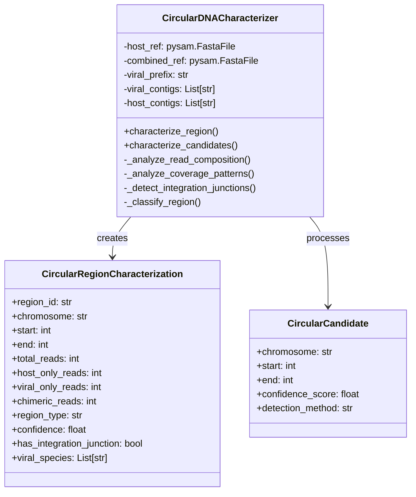
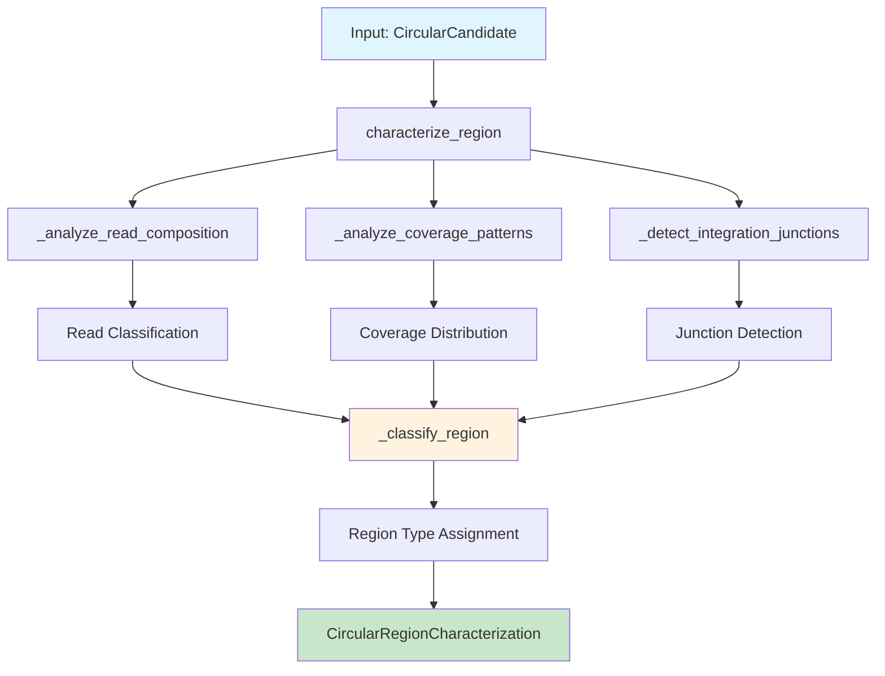
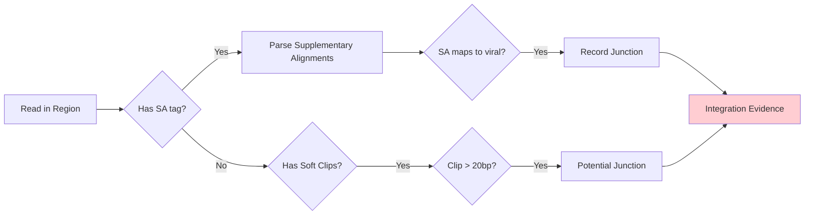
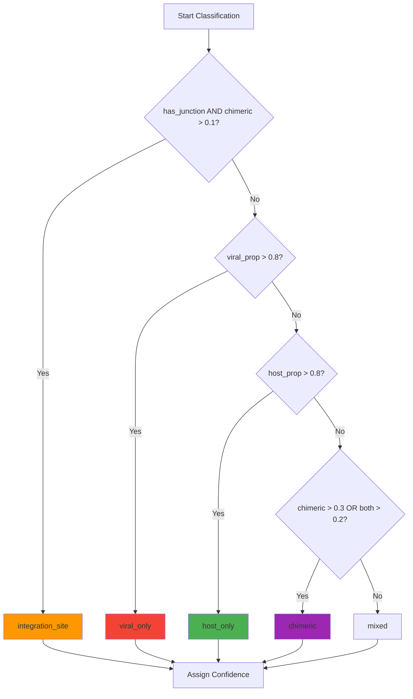
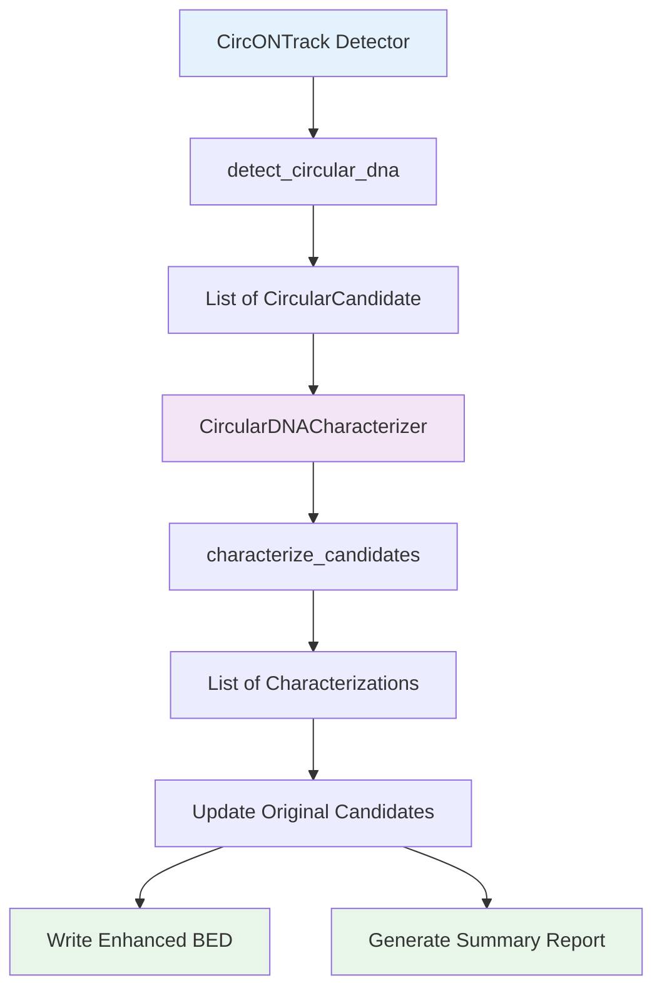

# CircONTrack Viral Characterization Module - Technical Documentation

## Overview

The characterization module extends CircONTrack to classify circular DNA regions based on their genomic composition, distinguishing between host-only circles, viral episomes, chimeric constructs, and integration sites.

## Core Architecture

### Class Structure



## Algorithm Flow

### Main Characterization Pipeline



## Core Functions

### 1. `_analyze_read_composition()`

**Purpose**: Classify individual reads within the circular DNA region based on their alignment patterns.

**Algorithm**:

1. **Read Collection Phase**
   - Fetch all reads from region in combined BAM where $\text{mapq} \geq \text{min\_mapq}$
   - Store unique read IDs in set $R$

2. **Read Classification**
   For each read $r \in R$:
   
   - Check if $r$ maps to host-only reference: $h_r \in \{0,1\}$
   - Get all alignments of $r$ in combined reference
   - Classify reference sequences as host ($H$) or viral ($V$) based on prefix
   
   **Classification Logic**:
   ```python
   if has_host_alignment and has_viral_alignment:
       category = "chimeric"
   elif has_viral_alignment and not maps_to_host_only:
       category = "viral_only"
   elif has_host_alignment or maps_to_host_only:
       category = "host_only"
   else:
       category = "unmapped"
   ```

3. **Output Metrics**:
   - Read counts: $n_{\text{host}}, n_{\text{viral}}, n_{\text{chimeric}}, n_{\text{unmapped}}$
   - Viral reference distribution
   - Mean read length: $\bar{l} = \frac{1}{|R|}\sum_{r \in R} l_r$

### 2. `_analyze_coverage_patterns()`

**Purpose**: Create spatial coverage distribution maps for host vs viral sequences.

**Algorithm**:

1. **Window-based Coverage Calculation**
   
   Given region $[s, e]$ on chromosome $c$:
   - Window size: $w = 100$ bp
   - Number of windows: $N = \lceil \frac{e - s}{w} \rceil$
   
   For each window $i \in [0, N)$:
   $$\text{window}_i = [s + i \cdot w, \min(s + (i+1) \cdot w, e)]$$

2. **Coverage Arrays**
   
   Initialize:
   - $C_{\text{host}}[i] = 0$ for host coverage
   - $C_{\text{viral}}[i] = 0$ for viral coverage
   
   For each read in window:
   ```python
   if _has_viral_alignment(read):
       C_viral[i] += 1
   else:
       C_host[i] += 1
   ```

3. **Coverage Metrics**
   
   $$\text{host\_coverage\%} = \frac{|\{i : C_{\text{host}}[i] > 0\}|}{N} \times 100$$
   
   $$\text{viral\_coverage\%} = \frac{|\{i : C_{\text{viral}}[i] > 0\}|}{N} \times 100$$

### 3. `_detect_integration_junctions()`

**Purpose**: Identify host-viral integration breakpoints using split-read signatures.

**Algorithm Flow**:



**Junction Detection Logic**:

1. **Supplementary Alignment (SA) Analysis**
   
   For reads with SA tag:
   - Parse SA string: `chromosome,position,strand,CIGAR,mapq,NM`
   - If SA reference $\in$ viral_contigs:
     - Junction position = read.reference_start or read.reference_end
     - Store breakpoint: $(j_{\text{host}}, j_{\text{viral}})$

2. **Soft-Clip Analysis**
   
   For CIGAR operations:
   - Start soft-clip: If $\text{CIGAR}[0] = (4, n)$ and $n > 20$
   - End soft-clip: If $\text{CIGAR}[-1] = (4, n)$ and $n > 20$
   - Record as potential junction

3. **Output**:
   - `has_junction`: Boolean flag
   - `breakpoints`: List of $(pos_{\text{host}}, pos_{\text{viral}})$ tuples
   - `junction_reads`: Count of supporting reads

### 4. `_classify_region()`

**Purpose**: Assign region type based on integrated evidence from all analyses.

**Classification Rules**:

Given:
- Total reads: $n_{\text{total}}$
- Read proportions:
  - $p_{\text{host}} = \frac{n_{\text{host}}}{n_{\text{total}}}$
  - $p_{\text{viral}} = \frac{n_{\text{viral}}}{n_{\text{total}}}$
  - $p_{\text{chimeric}} = \frac{n_{\text{chimeric}}}{n_{\text{total}}}$

**Decision Tree**:



**Confidence Scoring**:

$$\text{confidence} = \begin{cases}
\min(0.95, p_{\text{chimeric}} + 0.3) & \text{if integration\_site} \\
p_{\text{viral}} & \text{if viral\_only} \\
p_{\text{host}} & \text{if host\_only} \\
\max(p_{\text{chimeric}}, \frac{p_{\text{viral}} + p_{\text{host}}}{2}) & \text{if chimeric} \\
0.5 & \text{if mixed}
\end{cases}$$

### 5. `_has_viral_alignment()`

**Purpose**: Check if a read has any alignment to viral sequences.

**Logic**:
1. Check SA (Supplementary Alignment) tag
2. Parse SA entries for viral reference names
3. Check if primary alignment reference starts with `viral_prefix`

Returns: Boolean indicating viral alignment presence

### 6. `_calculate_gc_content()`

**Purpose**: Calculate GC content for the circular DNA region.

**Formula**:
$$\text{GC\%} = \frac{\#G + \#C}{\text{sequence\_length}} \times 100$$

Where sequence is fetched from reference: `ref.fetch(chrom, start, end)`

## Integration Functions

### `integrate_with_circontrack()`

**Purpose**: Seamlessly integrate characterization with CircONTrack pipeline.



**Data Flow**:
1. CircONTrack detects candidates using coverage/junction/split-read methods
2. Each candidate is characterized for viral content
3. Original candidates are enriched with:
   - `region_type`: Classification result
   - `has_viral`: Boolean flag
   - `is_integration`: Integration site flag
   - `viral_species`: List of detected viruses

## Output Formats

### Enhanced BED Format

```
#chr  start  end  name  score  strand  method  length  region_type  confidence  host_reads  viral_reads  chimeric_reads  has_integration  viral_species
chr1  1000   5000  circDNA_1  850  .  coverage  4000  integration_site  0.875  45  12  23  True  EBV,CMV
```

### Summary Report Columns

| Column | Description | Calculation |
|--------|-------------|-------------|
| `Region_ID` | Unique identifier | `circDNA_{index}` |
| `Type` | Classification | From `_classify_region()` |
| `Host_Coverage_%` | Spatial host coverage | $\frac{\text{windows with host reads}}{\text{total windows}} \times 100$ |
| `Viral_Coverage_%` | Spatial viral coverage | $\frac{\text{windows with viral reads}}{\text{total windows}} \times 100$ |
| `Characterization_Confidence` | Classification confidence | Region-type specific formula |
| `Junction_Reads` | Integration support | Count of reads with SA to viral |

## Performance Considerations

### Memory Optimization
- Reads processed in streaming fashion via `pysam.fetch()`
- Window-based coverage reduces memory for large regions
- Read IDs stored in set to avoid duplicates

### Computational Complexity

For a region with $n$ reads and length $L$:
- Read composition: $O(n \cdot m)$ where $m$ is alignments per read
- Coverage patterns: $O(n + L/w)$ where $w$ is window size
- Junction detection: $O(n)$
- Overall: $O(n \cdot m + L/w)$

## Usage Examples

### Standalone Characterization
```bash
python characterization.py characterize \
    circontrack_output.bed \
    mm10.fasta \
    mm10_viral.fasta \
    sample.mm10.bam \
    sample.combined.bam \
    --viral-prefix "viral_" \
    -o results
```

### Integrated Pipeline
```python
from circDNA_detection import CircularDNADetector
from characterization import CircularDNACharacterizer

# Initialize
detector = CircularDNADetector(min_fold_enrichment=1.5)
characterizer = CircularDNACharacterizer(host_ref, combined_ref)

# Detect and characterize
candidates = detector.detect_circular_dna(bam, ref)
characterizations = characterizer.characterize_candidates(
    candidates, host_bam, combined_bam
)
```

## Biological Interpretation

| Region Type | Biological Meaning | Key Features |
|-------------|-------------------|--------------|
| `host_only` | Normal eccDNA from host genome | No viral reads, uniform host coverage |
| `viral_only` | Free viral episomes | Pure viral reads, no host background |
| `chimeric` | Complex rearrangements | Mixed read types, potential recombination |
| `integration_site` | Viral integration into host | Junction reads, chimeric signatures, breakpoints |

## Error Handling

The module handles:
- Missing references gracefully
- Reads without alignments
- Empty regions (no reads)
- Missing SA tags
- Invalid CIGAR strings

All errors default to safe classifications with low confidence scores.