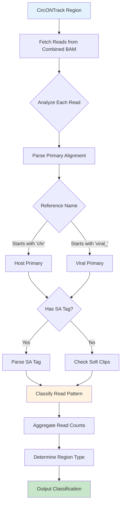
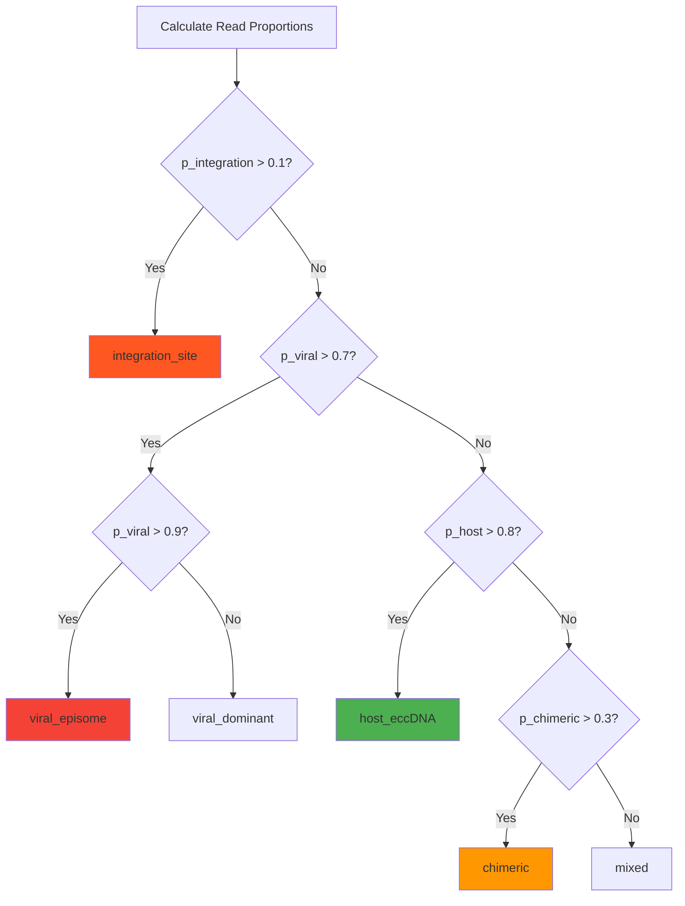

# CircONTrack Classify Module - Technical Documentation

## Overview

The CircONTrack Classify module identifies the genomic composition of circular DNA regions detected by CircONTrack, distinguishing between host eccDNA, viral episomes, and integration sites using **only a single BAM file** aligned to a combined host+viral reference.

## Key Innovation: Single BAM Classification

Unlike traditional approaches requiring multiple alignments, this module leverages the fact that viral genomes are separate contigs in the reference:

```
Combined Reference Structure:
├── chr1 (mouse) ────── 195 Mb
├── chr2 (mouse) ────── 182 Mb
├── ...
├── chrX (mouse) ────── 171 Mb
├── viral_EBV ────────── 172 kb
├── viral_CMV ────────── 235 kb
└── viral_AAV ──────────   5 kb
```

## Core Classification Algorithm



## Read Classification Patterns

### Pattern 1: Pure Host eccDNA

```
Read Alignments:
┌─────────────────────────────────┐
│ Read_001: chr19:1000-6000       │ ← Maps to mouse
│ Read_002: chr19:1050-6050       │ ← Maps to mouse
│ Read_003: chr19:1100-6100       │ ← Maps to mouse
└─────────────────────────────────┘

BAM Records:
RNAME: chr19, CIGAR: 5000M, SA: none
RNAME: chr19, CIGAR: 5000M, SA: none
RNAME: chr19, CIGAR: 5000M, SA: none

Classification: host_eccDNA (100% host reads)
```

### Pattern 2: Viral Episome (Circular Viral DNA)

```
Circular Viral Genome (5kb):
    [====VIRAL GENOME====]
         ↺ circles back

Long ONT Read (15kb) from circular viral DNA:
[====VIRAL====|====VIRAL====|====VIRAL====]
     1st copy      2nd copy      3rd copy

BAM Representation:
Primary:   viral_AAV:0-5000    CIGAR: 5000M10000S
SA Tag:    viral_AAV,0,+,5000S5000M5000S,60,0;viral_AAV,0,+,10000S5000M,60,0
           ↑                   ↑                 ↑
      Same viral ref      Wraps around      Third copy

Classification: viral_episome (multiple alignments to same viral contig)
```

### Pattern 3: Integration Site

```
Integration Junction:
[======MOUSE GENOME======|======VIRAL INSERT======|======MOUSE GENOME======]
                         ↑                        ↑
                    Junction 1               Junction 2

ONT Read Spanning Junction:
Read_junction: [====13kb mouse====|====12kb viral====]

BAM Record:
RNAME: chr19
POS: 61174743
CIGAR: 13000M12000S         ← Large soft clip!
SA:Z:viral_CMV,3000,+,13000S12000M,55,0
      ↑                ↑
  Viral reference   Soft-clipped mouse part

Classification: integration_site (chimeric reads with host-viral junctions)
```

### Pattern 4: Complex Rearrangement

```
Complex Structure:
[==mouse==]→[==viral==]→[==mouse==]→[==viral==]

Read: [==10kb==|==8kb==|==12kb==|==10kb==]

BAM Record:
RNAME: chr19
CIGAR: 10000M30000S
SA:Z:viral_EBV,1000,+,10000S8000M22000S,50,0;chr19,61200000,+,18000S12000M10000S,55,0;viral_EBV,5000,+,30000S10000M,50,0

Multiple SA entries alternating between host and viral
Classification: complex_rearrangement
```

## Core Functions and Logic

### `_classify_read()` Function

```python
def _classify_read(self, read) -> Tuple[str, set]:
    """
    Determines read type based on alignment pattern
    
    Decision Tree:
                    Read
                     |
            Primary Alignment Ref
                /          \
            Host          Viral
             |              |
         Check SA        Check SA
          /    \          /    \
       No SA   Has SA   No SA  Has SA
         |       |        |      |
    host_only   Check   viral_  Check
               SA refs   only   SA refs
                 |               |
            Viral refs?     Host refs?
              /    \          /    \
            No     Yes       No    Yes
            |       |        |      |
        host_only  Check  viral_  integration
                   clips   only
                    |
                Large clips?
                  /    \
                No      Yes
                |        |
            chimeric  integration
    """
```

### SA Tag Parsing Logic

```python
# SA Tag Format: reference,position,strand,CIGAR,mapQ,editDistance;...

def parse_sa_tag(sa_tag: str) -> List[Dict]:
    """
    Example SA tag parsing:
    
    Input: "viral_CMV,3000,+,13000S12000M,55,0;chr19,50000,-,5000S5000M,50,2"
    
    Output: [
        {
            'ref': 'viral_CMV',     # ← Viral reference!
            'pos': 3000,
            'strand': '+',
            'cigar': '13000S12000M',
            'mapq': 55,
            'is_viral': True
        },
        {
            'ref': 'chr19',          # ← Host reference
            'pos': 50000,
            'strand': '-',
            'cigar': '5000S5000M',
            'mapq': 50,
            'is_viral': False
        }
    ]
    """
```

### Soft Clip Analysis

```python
def analyze_soft_clips(read) -> Dict:
    """
    Soft clip patterns indicate junction types:
    
    Small clips (<30bp): Likely sequencing artifacts
    ├── CIGAR: 5S100M3S
    └── Interpretation: Normal alignment variation
    
    Large clips (>30bp): Potential junctions
    ├── CIGAR: 1000M1000S
    ├── Check SA tag for clipped sequence location
    └── If SA = different ref type → Integration junction
    
    Boundary clips: Integration signatures
    ├── Start: 500S1000M → Junction at read start
    └── End: 1000M500S → Junction at read end
    """
```

## Region Classification Logic

### Classification Decision Matrix

```python
def _determine_region_type(stats: Dict) -> Tuple[str, float]:
    """
    Region classification based on read composition:
    
    Total reads = N
    ├── host_only_reads = H
    ├── viral_only_reads = V
    ├── chimeric_reads = C
    └── integration_junction_reads = I
    
    Proportions:
    p_host = H/N, p_viral = V/N, p_chimeric = C/N, p_integration = I/N
    """
```



### Confidence Scoring

$$\text{confidence} = \begin{cases}
\min(0.95, p_{\text{integration}} + p_{\text{chimeric}}) & \text{if integration\_site} \\
p_{\text{viral}} & \text{if viral\_episome} \\
p_{\text{host}} & \text{if host\_eccDNA} \\
\max(p_{\text{chimeric}}, \frac{p_{\text{viral}} + p_{\text{host}}}{2}) & \text{if chimeric} \\
\max(p_{\text{host}}, p_{\text{viral}}, p_{\text{chimeric}}) & \text{if mixed}
\end{cases}$$

## Implementation Details

### Memory-Efficient Read Processing

```python
# Stream reads instead of loading all into memory
read_ids_seen = set()  # Avoid counting reads twice

for read in bam.fetch(chrom, start, end):
    if read.query_name in read_ids_seen:
        continue
    read_ids_seen.add(read.query_name)
    
    # Process read...
```

### Viral Species Tracking

```python
viral_species = set()

# Extract species from viral contig names
# viral_EBV → EBV
# viral_CMV_strain_X → CMV_strain_X

for viral_ref in viral_refs:
    species = viral_ref.replace(viral_prefix, '').strip('_')
    viral_species.add(species)
```

## Output Formats

### Classified BED Format

```
#chrom  start     end       name        score  strand  type              confidence  total  host  viral  chimeric  integration  viral_species
chr19   61174743  61288479  circDNA_1   950    .       integration_site  0.950       120    45    23     40        12          CMV,EBV
chr2    10000     15000     circDNA_2   850    .       host_eccDNA       0.850       89     76    0      13        0           none
chr5    20000     25000     circDNA_3   920    .       viral_episome     0.920       95     5     87     3         0           AAV
```

### Summary Report Structure

```
CircONTrack Classification Summary
============================================================

Total regions analyzed: 156

Classification breakdown:
  host_eccDNA         :   89 (57.1%)
  viral_episome       :   23 (14.7%)
  viral_dominant      :   12 ( 7.7%)
  integration_site    :   18 (11.5%)
  chimeric           :    9 ( 5.8%)
  mixed              :    5 ( 3.2%)

Viral species detected:
  EBV: 28 regions
  CMV: 15 regions
  AAV: 10 regions

18 potential integration sites:
  circDNA_1: chr19:61174743-61288479 (CMV,EBV) [12 junction reads]
  circDNA_8: chr3:45000000-45010000 (AAV) [8 junction reads]
  ...
```

## Performance Optimization

### Computational Complexity

For a region with $n$ reads:
- Read classification: $O(n)$
- SA tag parsing: $O(n \times s)$ where $s$ is average SA entries per read
- Overall: $O(n \times s)$

### Optimizations

1. **Single BAM pass**: No need for multiple BAM files
2. **Set-based deduplication**: Avoid processing reads multiple times
3. **Early termination**: Skip regions with no reads
4. **Lazy SA parsing**: Only parse when needed

## Biological Interpretation Guide

| Classification | Biological Meaning | Key Features | Clinical Relevance |
|---------------|-------------------|--------------|-------------------|
| `host_eccDNA` | Normal extrachromosomal circular DNA | >80% host reads, no viral | Background eccDNA |
| `viral_episome` | Free circular viral DNA | >90% viral reads, circular signatures | Active viral replication |
| `viral_dominant` | Mostly viral with some host | 70-90% viral | Possible contamination or early integration |
| `integration_site` | Viral DNA integrated into host genome | Junction reads, chimeric signatures | Potential oncogenic |
| `chimeric` | Complex host-viral rearrangement | Multiple transitions | Genome instability |
| `mixed` | Unclear classification | No dominant type | Requires manual review |

## Usage Examples

### Basic Classification
```bash
# Minimal command
circontrack-classify circdna.bed combined_ref.fa combined.bam -o results

# Output files:
# - results_classified.bed
# - results_summary.txt
```

### With Custom Parameters
```bash
# Custom viral prefix and quality threshold
circontrack-classify circdna.bed combined_ref.fa combined.bam \
    --viral-prefix "virus_" \
    --min-mapq 30 \
    -o high_quality_results
```

### Python API
```python
from circDNA_detection.classify import SimplifiedCircularDNAClassifier

# Initialize
classifier = SimplifiedCircularDNAClassifier(
    combined_ref='mm10_plus_viral.fa',
    viral_contig_prefix='viral_'
)

# Classify regions
results = classifier.classify_bed_file(
    bed_file='circontrack_output.bed',
    combined_bam_path='sample.combined.bam',
    output_prefix='classified'
)

# Access results programmatically
for region in results:
    if region['type'] == 'integration_site':
        print(f"Integration at {region['chrom']}:{region['start']}")
        print(f"Viral species: {region['viral_species']}")
```

## Validation and Quality Control

### Expected Patterns by Sample Type

| Sample Type | Expected Distribution |
|------------|----------------------|
| Normal tissue | >95% host_eccDNA, <5% other |
| Viral infection | Mix of host_eccDNA and viral_episome |
| Cancer with viral integration | Presence of integration_site regions |
| Cell line with viral vectors | High proportion of viral_episome |

### Quality Metrics

1. **Read depth**: Minimum 10 reads per region for confident classification
2. **Junction support**: ≥2 junction reads for integration site confirmation  
3. **Consistency**: Multiple reads showing same pattern increases confidence

## Troubleshooting

| Issue | Possible Cause | Solution |
|-------|---------------|----------|
| No viral detected | Wrong viral prefix | Check reference contig names |
| All regions "mixed" | Low coverage | Increase sequencing depth |
| False integration sites | Short read contamination | Increase min_mapq threshold |
| Missing episomes | Circular reads not detected | Check aligner settings for supplementary alignments |

## Summary

The CircONTrack Classify module provides a streamlined, single-BAM approach to characterizing circular DNA regions by:

1. Leveraging long-read advantages to detect chimeric molecules directly
2. Using SA tags and soft clips to identify integration junctions
3. Classifying regions based on read composition patterns
4. Providing confidence scores for each classification

This approach is both computationally efficient and biologically informative, making it ideal for studying viral-host interactions in long-read sequencing data.