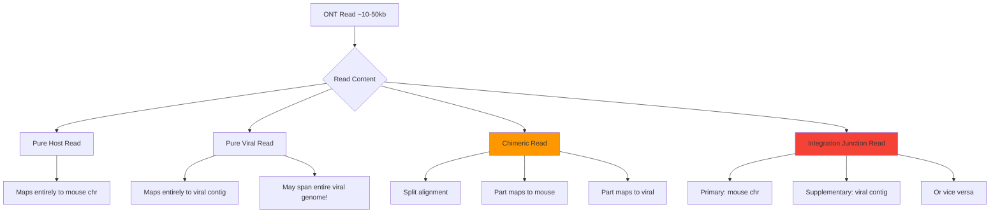

# ONT Read Mapping Scenarios

## Understanding the Reference Structure

```
mm10+viral reference:
- chr1 (mouse) - 195 Mb
- chr2 (mouse) - 182 Mb
- ...
- chrX (mouse) - 171 Mb
- viral_EBV - 172 kb
- viral_CMV - 235 kb
- viral_AAV - 4.7 kb
```



Key Mapping Patterns

1. Pure Viral Episome (Circular Viral DNA)

```
Read: [========================================] 30kb
Maps: viral_EBV:0-15000 + viral_EBV:0-15000
      (same viral genome covered twice - circular!)
```

2. Integration Site

```
Read: [=======mouse========|=====viral=====] 25kb
Primary:    chr19:1000-13000
Supplementary (SA tag): viral_CMV:5000-17000
```

3. Complex Rearrangement

```
Read: [==mouse==|==viral==|==mouse==] 40kb
Multiple supplementary alignments
```

