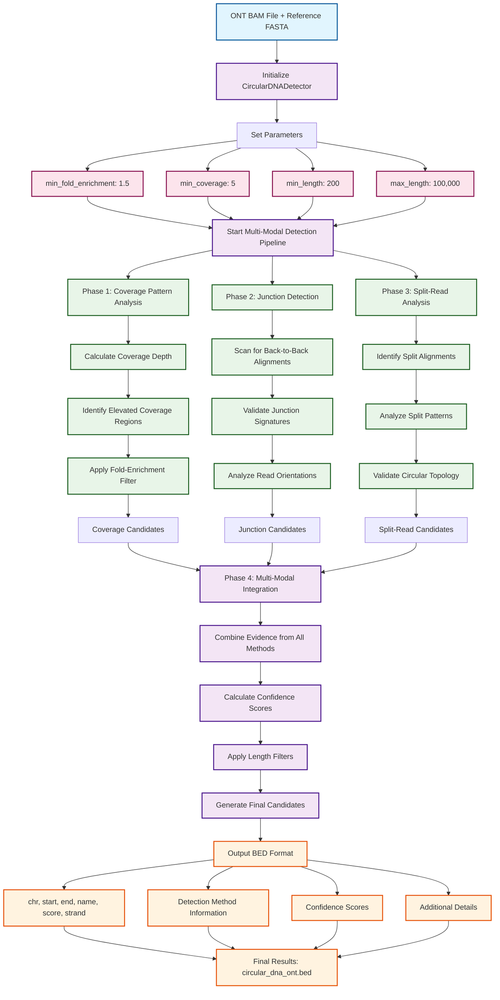

```mermaid
graph TD
    A[ONT BAM File + Reference FASTA] --> B[Initialize CircularDNADetector]
    B --> C[Set Parameters]
    C --> D[min_fold_enrichment: 1.5]
    C --> E[min_coverage: 5]
    C --> F[min_length: 200]
    C --> G[max_length: 100,000]
    
    D --> H[Start Multi-Modal Detection Pipeline]
    E --> H
    F --> H
    G --> H
    
    H --> I[Phase 1: Coverage Pattern Analysis]
    H --> J[Phase 2: Junction Detection]
    H --> K[Phase 3: Split-Read Analysis]
    
    I --> L[Calculate Coverage Depth]
    L --> M[Identify Elevated Coverage Regions]
    M --> N[Apply Fold-Enrichment Filter]
    N --> O[Coverage Candidates]
    
    J --> P[Scan for Back-to-Back Alignments]
    P --> Q[Validate Junction Signatures]
    Q --> R[Analyze Read Orientations]
    R --> S[Junction Candidates]
    
    K --> T[Identify Split Alignments]
    T --> U[Analyze Split Patterns]
    U --> V[Validate Circular Topology]
    V --> W[Split-Read Candidates]
    
    O --> X[Phase 4: Multi-Modal Integration]
    S --> X
    W --> X
    
    X --> Y[Combine Evidence from All Methods]
    Y --> Z[Calculate Confidence Scores]
    Z --> AA[Apply Length Filters]
    AA --> BB[Generate Final Candidates]
    
    BB --> CC[Output BED Format]
    CC --> DD[chr, start, end, name, score, strand]
    CC --> EE[Detection Method Information]
    CC --> FF[Confidence Scores]
    CC --> GG[Additional Details]
    
    DD --> HH[Final Results: circular_dna_ont.bed]
    EE --> HH
    FF --> HH
    GG --> HH
    
    %% Styling
    classDef inputFile fill:#e1f5fe,stroke:#01579b,stroke-width:2px
    classDef process fill:#f3e5f5,stroke:#4a148c,stroke-width:2px
    classDef analysis fill:#e8f5e8,stroke:#1b5e20,stroke-width:2px
    classDef output fill:#fff3e0,stroke:#e65100,stroke-width:2px
    classDef parameter fill:#fce4ec,stroke:#880e4f,stroke-width:2px
    
    class A inputFile
    class B,H,X,Y,Z,AA,BB process
    class I,J,K,L,M,N,P,Q,R,T,U,V analysis
    class CC,DD,EE,FF,GG,HH output
    class D,E,F,G parameter
```