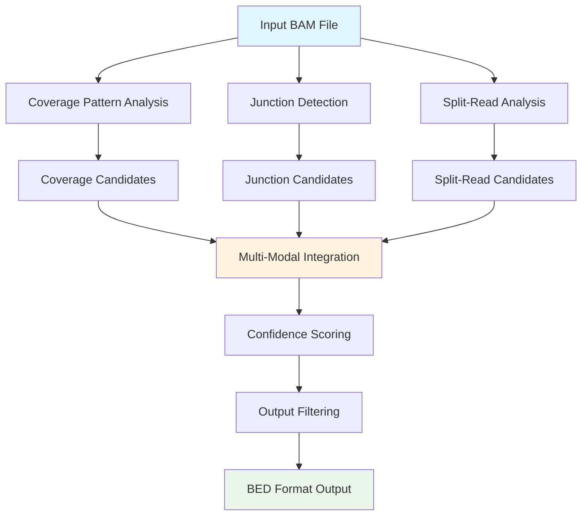
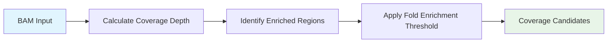
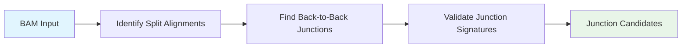
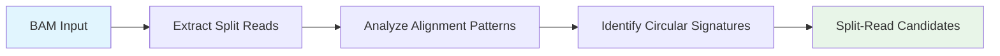
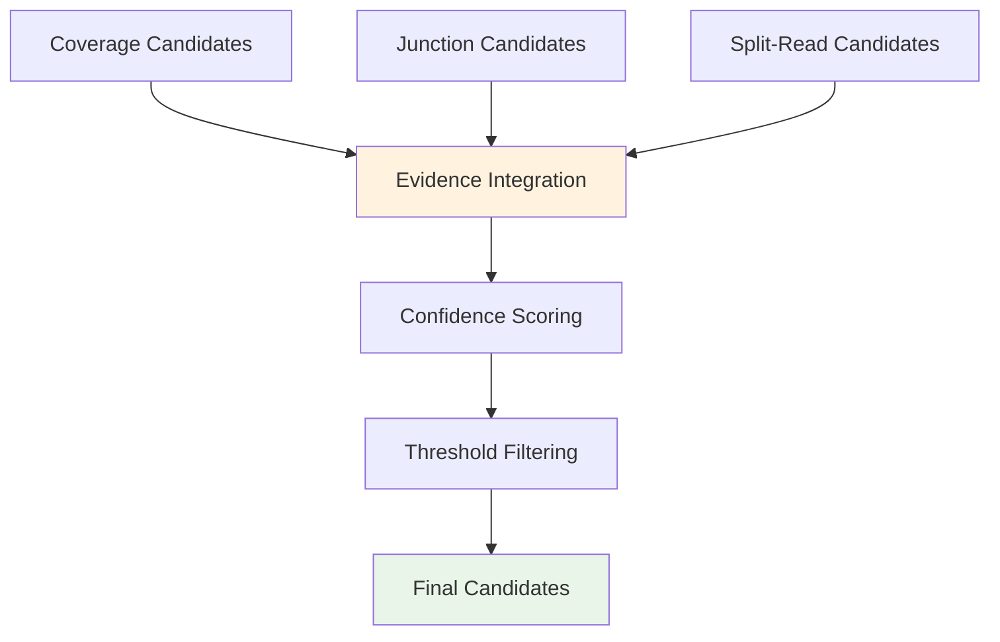

# Detection Workflow

This page describes the complete workflow of the circDNA detection pipeline, showing how the different detection methods work together to identify circular DNA elements.

## Pipeline Overview

The circDNA detection pipeline consists of four main phases that work together to provide comprehensive circular DNA detection:

## Detailed Workflow

### Phase 1: Coverage Pattern Analysis

**Purpose**: Identifies regions with elevated coverage patterns characteristic of circular DNA elements.

**Process**:
1. Calculate coverage depth across all genomic regions
2. Identify regions with significantly elevated coverage
3. Apply minimum fold enrichment threshold (default: 1.5x)
4. Filter by minimum coverage depth (default: 5x)

### Phase 2: Junction Detection

**Purpose**: Detects back-to-back junction signatures at circular DNA breakpoints.

**Process**:
1. Identify reads with split alignments
2. Look for back-to-back junction patterns
3. Validate junction signatures for circular characteristics
4. Filter by junction quality and support

### Phase 3: Split-Read Analysis

**Purpose**: Analyzes split alignments for signatures consistent with circular DNA structures.

**Process**:
1. Extract reads with split alignments
2. Analyze alignment patterns for circular signatures
3. Identify reads supporting circular structures
4. Validate split-read evidence

### Phase 4: Multi-Modal Integration

**Purpose**: Combines evidence from all detection methods and assigns confidence scores.

**Process**:
1. Integrate candidates from all detection methods
2. Calculate multi-evidence confidence scores
3. Apply final filtering thresholds
4. Generate final candidate list

## Parameter Configuration

The workflow can be customized through various parameters:

| Parameter | Default | Description |
|-----------|---------|-------------|
| `min_fold_enrichment` | 1.5 | Minimum fold enrichment for coverage detection |
| `min_coverage` | 5 | Minimum coverage depth |
| `min_length` | 200 | Minimum circular DNA length |
| `max_length` | 100000 | Maximum circular DNA length |

## Output Generation

The final step generates results in BED format with additional columns:

- Standard BED columns (chr, start, end, name, score, strand)
- Detection method information
- Confidence scores
- Supporting evidence details

## Quality Control

Throughout the pipeline, multiple quality control measures ensure reliable detection:

- **Coverage validation**: Ensures sufficient read support
- **Junction validation**: Confirms genuine circular junction signatures
- **Split-read validation**: Validates split-read evidence quality
- **Multi-modal consensus**: Requires evidence from multiple detection methods for high-confidence calls